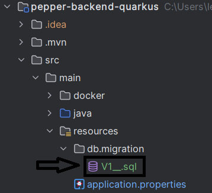
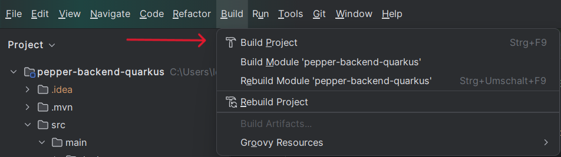
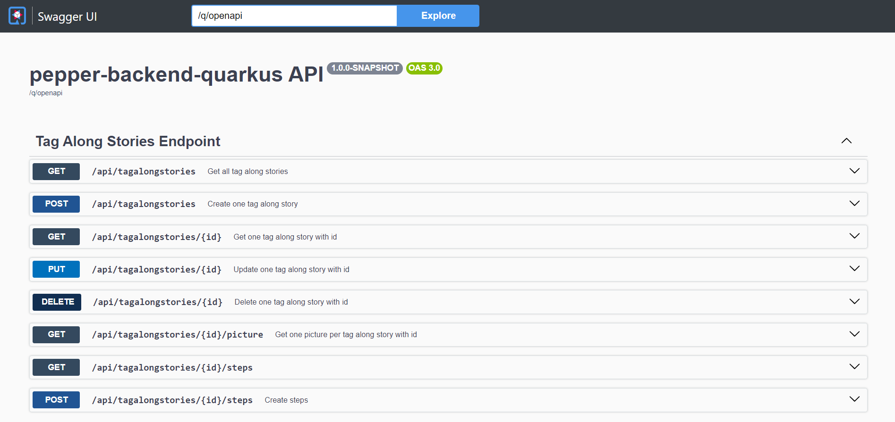
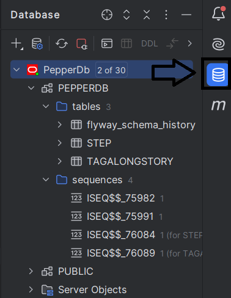
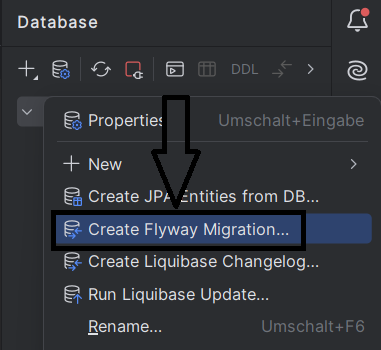
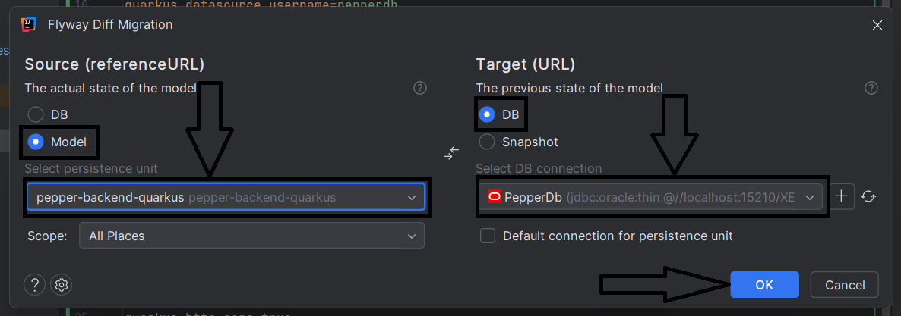

:doctype: book
:toc:
:toc-title: Table of Contents
:toc-placement: preamble

# PEPPER Backend Guide

[.center]
image::https://quarkus.io/assets/images/brand/quarkus_logo_vertical_450px_reverse.png[Quarkus Logo, link=https://quarkus.io/, align=center]

*Quarkus* is a modern, *Kubernetes-native* 🚀 Java framework designed to *optimize Java applications* for *cloud environments*, especially *containers* 🐳. It is built around familiar *Java libraries and standards* (like *JAX-RS, CDI,* and *Hibernate*), but with a strong focus on *fast startup times* ⚡, *low memory usage* 📉, and *developer productivity* 🧑‍💻.

== Introduction

*Pepper in Elderly Care* is a cool project that helps make life better for *seniors in nursing homes*. 🏡👵🤖 Pepper the robot is the *star*, bringing *fun games* and *activities* to brighten their day! 🎉🎮😊🌟 It also *helps with food plans* so seniors can choose what they want to eat. 🍲🥗🍎

== Prerequisites

*Language*: Java 17 or higher +
*Framwork*: Qurakus 3.14.4 or higher +
*IDE*: IntelliJ IDEA (recommended) +
*Build tool*: Apache Maven 3.13.0 or higher +
*Container runtime*: Docker +
*Operating system*: Windows, macOS, or Linux +
*Database*: Oracle Database 19c or higher

== Getting Started

This document will guide you through the process of setting up the *BACKEND of Pepper in Elderly Care* project on your local machine. Most of the *screenshots* are from *IntelliJ IDEA*, so it is *recommended* to use *IntelliJ*. 🖥️🤖🎮

* 🚀 **Step 1: Setup Oracle Database on Docker**  +
  **↳** 📄 *Follow the instructions* in the given PDF.  
  **↳** 🔗 link:docs/DockerOracleWin.pdf[Docker Oracle Database Setup PDF]  +
  **↳** 🐳 *Run the Oracle Database* on Docker.

* 🌱 **Step 2: Clone/Fork the Repository**  +
  **↳** 🌐 [GitHub Repository](https://github.com/KyawIT/PEPPER)

* 📂 **Step 3: Open the Project in IntelliJ IDEA**  +
  **↳** 🗂️ *Open IntelliJ IDEA* and select *File* > *Open* and navigate to the project folder.

  image::images/Project_Open.png[Open Project in IntelliJ IDEA, align=center]

* ⚙️ **Step 4: Configure the Database**  +
  **↳** 📄 *Open the* `application.properties` *file in the* `resources` *folder.*  +
  **↳** ✏️ *Update the database URL, username, and password* with your Oracle Database settings.  
  

[source,properties]
----
# Application configuration example
quarkus.datasource.db-kind=oracle
quarkus.datasource.username=pepperdb123
quarkus.datasource.password=pepperdb123
quarkus.datasource.jdbc.url=jdbc:oracle:thin:@/localhost:15210/XEPDB1
----

* 🛠️ **Step 5: Create the Database Schema**  +
  **↳** 📜 *Run the latest SQL script in the* `resources` *folder to create the database schema.*  +
  **↳** 📝 *Example SQL script: `V1__.sql`.*

* 🏗️ **Step 6: Build the Project**  +
  **↳** ⌨️ *Press* `Ctrl + F9` *to build the project.*  +
  **↳** 🍔 *Or click the* *hamburger icon* *in the top left corner.*

* ▶️ **Step 7: Run the Project**  +
  **↳** ⌨️ *Press* `Shift + F10` *to run the project.*  +
  **↳** 🟢 *Or click the green play icon* *in the top right corner.*

* 📜 **Step 8: Access Swagger**  +
  **↳** 🌐 *Open your browser and go to* `http://localhost:8080/swagger-ui/` *to see the Swagger UI.*

== Future Steps

* 🔄 *Manage Database Migrations*  +
**↳** 🔍 *If you add more models, open the Database GUI in IntelliJ IDEA and right-click to select* *Create Flyway Migration.*  +
  **↳** 📁 *Ensure you have a* `resources/db/migration` *folder in your project. If not, create it.*

image::images/DB_Migration_Proj-Struct.png[DatabaseSelection, align=center]

**↳** 🗃️ *Select the Database icon in the top right corner of IntelliJ IDEA.*

**↳** 👉 *Right-click on the Database icon and select* *Create Flyway Migration.*

**↳** ✅ *Ensure your settings match those below and click* *OK.*

**↳** 📜 *You will see the SQL script in the* `resources/db/migration` *folder. Update the script with the latest changes.*

== Project Structure

image::images\Proj_Struct.png[Project Structure, align=center]

* 📂 **Controller/**  
  **↳** 🌐 *REST controllers* – Define API endpoints.

* ⚙️ **Service/**  
  **↳** 🧠 *Business logic* – Handle the application's core logic.

* 📝 **Model/**  
  **↳** 🗂️ *Data model* – Represents the structure of data.

* 📊 **Repository/**  
  **↳** 💾 *Data access* – Interacts with the database.

* 🚀 **DTOs/**  
  **↳** 🔄 *Data Transfer Object* – Transfers data between layers.

* 🧪 **Test/**  
  **↳** ✅ *Test classes* – Unit and integration tests.

* 📁 **resources/**  
  **↳** ⚙️ *Application properties* – Configuration settings. +  
  **↳** 📝 *application.properties* – Main configuration file.  +
  **↳** 🗃️ *Database configuration* – Database settings.

* 🐳 **Dockerfile**  
  **↳** 📦 *Docker configuration* – Container setup.

* 📜 **pom.xml**  
  **↳** 🛠️ *Maven configuration* – Build setup. +  
  **↳** 📚 *Dependencies* – Libraries and tools.

== Dependencies

1. *Quarkus RESTEasy* (`quarkus-resteasy`): For building RESTful APIs in Quarkus 🌐🚀.

2. *Quarkus RESTEasy Jackson* (`quarkus-resteasy-jackson`): Handles JSON serialization/deserialization in REST services 📄🔄.

3. *Quarkus ARC* (`quarkus-arc`): Supports dependency injection for better code structure 🧩🤖.

4. *Quarkus JUnit 5* (`quarkus-junit5`): Enables testing with JUnit 5 📊✅.

5. *Rest-Assured* (`rest-assured`): Simplifies REST API testing 🔍🧪.

6. *Quarkus SmallRye OpenAPI* (`quarkus-smallrye-openapi`): Automatically generates OpenAPI docs 📜🔍.

7. *MicroProfile OpenAPI API* (`microprofile-openapi-api`): Provides annotations for OpenAPI documentation 📑✏️.

8. *Quarkus JDBC Oracle* (`quarkus-jdbc-oracle`): Connects to Oracle databases using JDBC 🔗🗄️.

9. *Quarkus Flyway* (`quarkus-flyway`): Manages database migrations and versioning 📈🔧.

10. *Quarkus Hibernate ORM Panache* (`quarkus-hibernate-orm-panache`): Simplifies database interactions with an Active Record pattern 🗃️📝.
