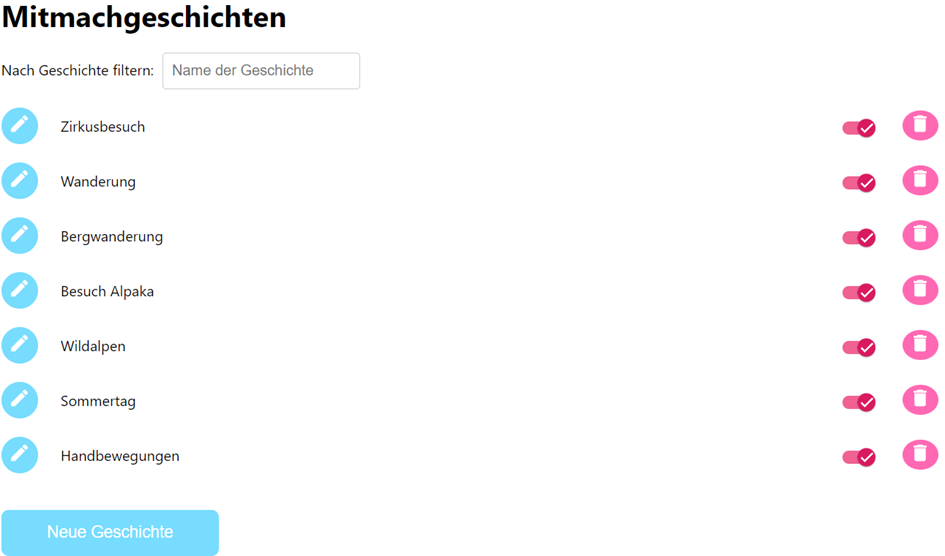
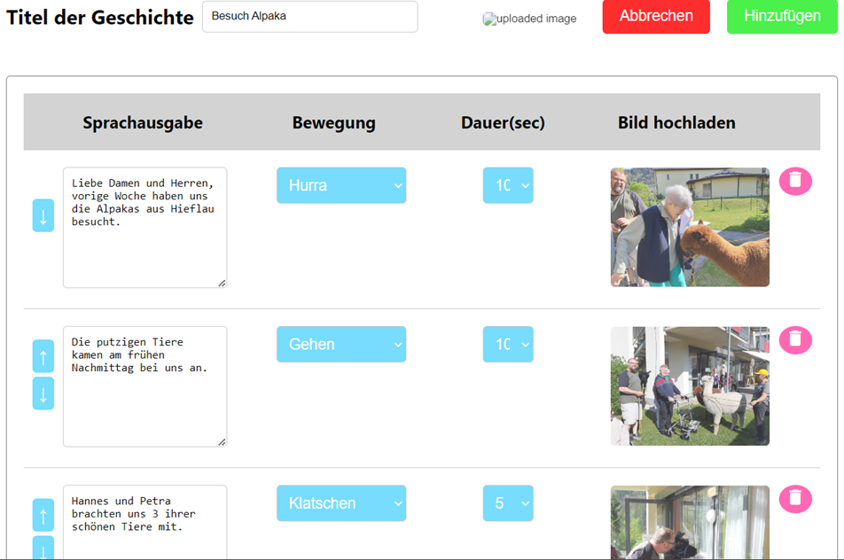
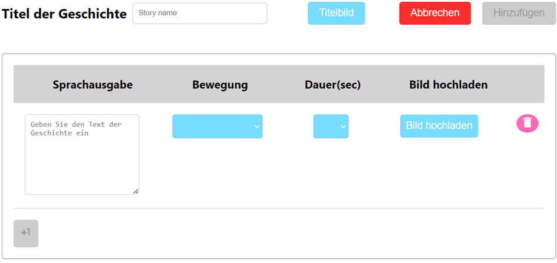
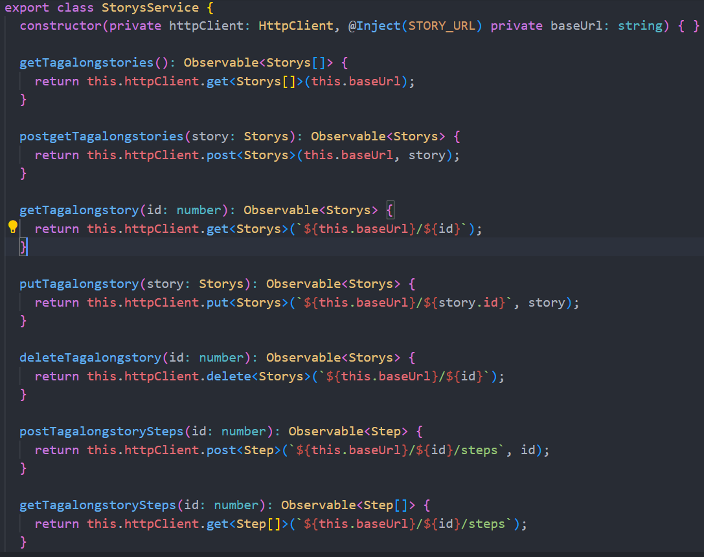
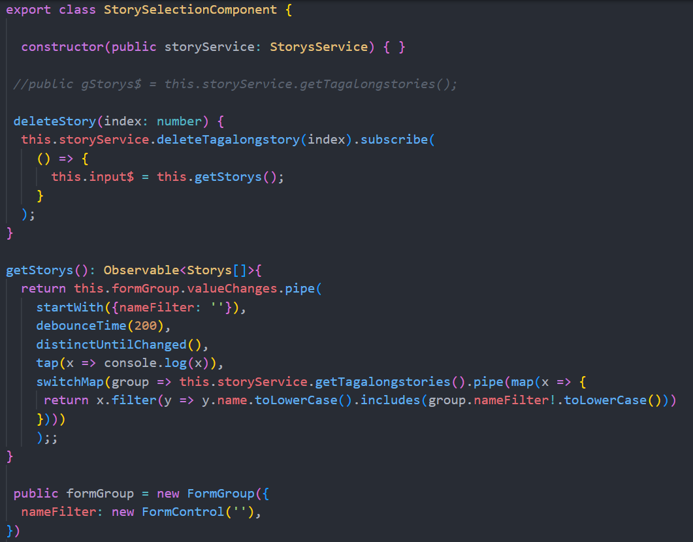
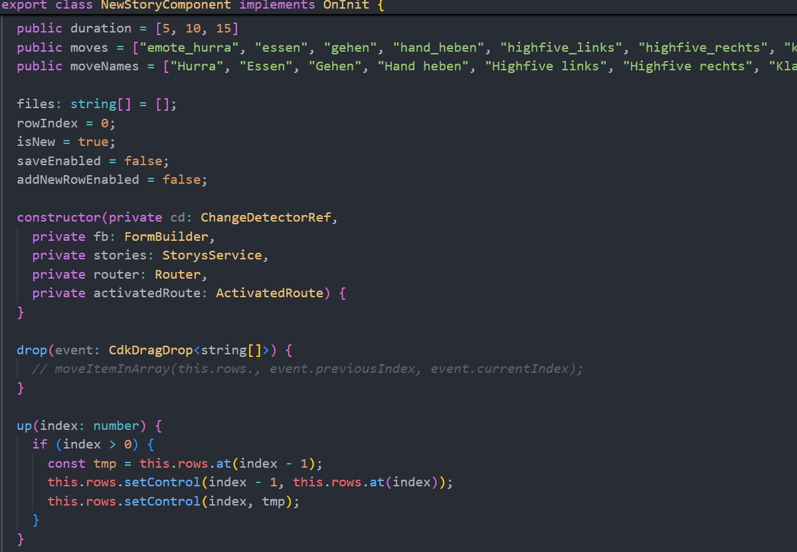
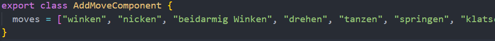
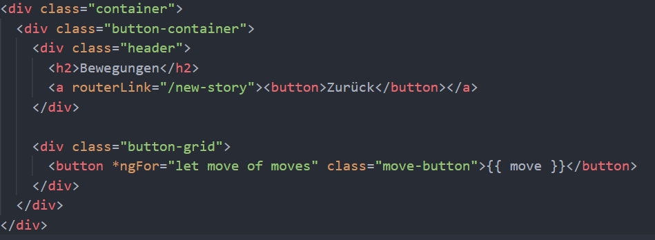

# Pepper GuideBook

1. [Angular Pepper (Mitmachgeschichten)](#angular-pepper-mitmachgeschichten)
2. [Pepper Kotlin](#pepper-kotlin)
3. [Backend C#](#backend-c)

# Angular Pepper (Mitmachgeschichten)

1. Geschichte selektieren ( http://localhost:4200/story-selection)

2. Beispiel: Besuch Alpaka (http://localhost:4200/new-story/39)

3. Beispiel: Seite für neue Geschichte (http://localhost:4200/new-story)

## Angular starten
1. AngularPepper Ordner in beliebige Editor öffnen
2. npm install
3. npm start
4. http://localhost:4200/

Dieser Angular-Dienst, **StorysService**, interagiert mit einem Backend-API.

## storys.service.ts

**StorysService**: Eine Service-Klasse, die Angulars HttpClient verwendet, um HTTP-Operationen für Stories und deren Schritte auszuführen.

**STORY_URL**: Wird als Basis-URL für alle API-Anfragen injiziert.

**Wichtige Methoden:**

- **getTagalongstories()**: Ruft eine Liste von Stories ab.
- **postgetTagalongstories()**: Sendet eine neue Story an den Server.
- **getTagalongstory()**: Ruft eine einzelne Story anhand ihrer ID ab.
- **putTagalongstory()**: Aktualisiert eine bestehende Story.
- **deleteTagalongstory()**: Löscht eine Story anhand ihrer ID.
- **postTagalongstorySteps()**: Fügt einer Story Schritte hinzu, basierend auf der ID.
- **getTagalongstorySteps()**: Ruft die Schritte einer bestimmten Story-ID ab.

## story-selection.component.ts

**Das Component filtert, löscht und aktualisiert die Geschichten dynamisch.**

**deleteStory(index: number):**
Löscht eine Geschichte basierend auf ihrer ID und aktualisiert anschließend die Liste der Geschichten.

**getStorys():**
Gibt ein Observable zurück, das den nameFilter überwacht, um die Geschichten nach Namen zu filtern und bei jeder Änderung des Formularwerts die Liste neu zu laden.

**toggle(event: MatSlideToggleChange, story: Storys):**
Schaltet das isEnabled-Attribut einer Geschichte um und speichert die Änderung. Danach wird die Liste der Geschichten aktualisiert.

**formGroup:**
Definiert ein Formular mit einem Feld (nameFilter) zur Filterung der Geschichten nach Namen.

**input$:**
Enthält die gefilterte Liste der Geschichten als Observable, die in der Komponente angezeigt wird.

## new-story.component.ts

**addRow():** Fügt eine neue Zeile für eine Story hinzu.

**removeRow(index):** Entfernt eine Zeile.

**save():** Speichert eine neue oder aktualisierte 
Story mit allen Schritten.

**onFileSelected() / onRowFileSelected():** Wandelt ausgewählte Bilder in Base64 um und fügt sie der Story oder den Schritten hinzu.

**ngOnInit():** Lädt bestehende Story-Daten (im Bearbeitungsmodus) und überwacht Formularänderungen.

**splitMoveNameAndDuration():** Teilt den Bewegungsnamen und die Dauer auf.

**drop(), up(), down():** Verwaltet das Verschieben von Zeilen.

## add-move.components.ts

**moves** Array in **AddMoveComponent:**

Im TypeScript-Code wird die Liste der Bewegungen **(moves = ["winken", "nicken", "tanzen", ...])** definiert. Diese Liste enthält verschiedene Bewegungen, die als Buttons angezeigt werden sollen.

Das HTML-Template nutzt die Angular-Direktive ***ngFor**, um eine **Schleife durch das moves-Array** zu durchlaufen.

moves Array

## Techstack

**Angular (v16):** Kernframework, mit Material UI, Animationen und CDK.

**TypeScript:** Für statisch typisiertes JavaScript.

**RxJS:** Für reaktive Programmierung.

**Ngx-Dropzone:** Komponente für Datei-Uploads.

**Testing:** Jasmine und Karma für Unit-Tests.

**Zone.js:** Verarbeitet asynchrone Operationen für Angular.

# Pepper Kotlin
## TagAlongStoryAPI (interface)
**TagAlongStoryAPI:** Eine Schnittstelle für die API-Anfragen.

**@GET("/tagalongstories"):**
**getAllTagAlongStories(@Query("withoutDisabled") withoutDisabled: Boolean = true):** 
Ruft eine Liste von TagAlongStory-Objekten ab. Der optionale Parameter withoutDisabled bestimmt, ob deaktivierte Geschichten ausgeschlossen werden sollen (Standardwert ist true).

**@GET("/tagalongstories/{id}/steps"):**
**getStoryById(@Path("id") id: Int):** Ruft eine Liste von Step-Objekten für eine bestimmte Geschichte basierend auf der ID ab.

## TagAlongStoryRequest
**getAllTagAlongStories():** Ruft alle TagAlongStory-Objekte von der API ab.

**getStoryById(id: Int):** Ruft Step-Objekte für eine bestimmte Geschichte anhand der ID ab.

## Screens
**enum class Screens:** Enum-Klasse, die alle Bildschirmtypen der App auflistet.

**Bildschirme:** MainScreen, DanceSelectionScreen, DanceScreen, etc.

**companion object:** Statische Methode innerhalb des Enums.

**fromRoute(route: String?):** Screens: Konvertiert einen Routennamen in einen entsprechenden Bildschirmtyp.

**Verwendet substringBefore("/")**, um den Routennamen zu extrahieren und vergleicht diesen mit den Namen der Bildschirmtypen.
Wenn die Route nicht erkannt wird, wird eine **IllegalArgumentException** ausgelöst.

# Backend C#
**var connectionString:** Verbindungszeichenfolge zur SQL-Datenbank.

**var builder = WebApplication.CreateBuilder(args);:** Erstellt einen Builder für die Webanwendung.

**Swagger:** Dokumentation der API.

**CORS:** Ermöglicht Cross-Origin-Anfragen.

**Controller:** JSON-Optionen für Controller konfigurieren.

**DbContext:** Konfiguration der Datenbankverbindung.

**Swagger:** Aktiviert die Swagger-UI für die API-Dokumentation.

**CORS:** Wendet die CORS-Policy an.

**app.MapGet("/tagalongstories"):** Ruft alle „Tag Along Stories“ ab.

**app.MapGet("/tagalongstories/{id}/picture"):** Holt das Bild einer spezifischen „Tag Along Story“.

**app.MapGet("/tagalongstories/{id}"):** Ruft eine spezifische „Tag Along Story“ anhand der ID ab.

**app.MapPost("/tagalongstories"):** Erstellt eine neue „Tag Along Story“.

**app.MapPut("/tagalongstories/{id}"):** Aktualisiert eine bestehende „Tag Along Story“.

**app.MapDelete("/tagalongstories/{id}"):** Löscht eine „Tag Along Story“.

**app.MapPost("/tagalongstories/{id}/steps"):** Fügt einen Schritt zu einer „Tag Along Story“ hinzu.

**app.MapGet("/tagalongstories/{id}/steps"):** Holt alle Schritte einer „Tag Along Story“.

## Converter
**ConvertToTagAlongStory:**
Zweck: Konvertiert TagAlongStoryDTO in TagAlongStory.
- **Logik:**
Aktualisiert vorhandenes TagAlongStory bei ID ≠ -1, erstellt neues bei ID = -1.
Entschlüsselt StoryIcon, konvertiert Schritte.

**ConvertToStepAsync:**
- **Zweck:** Konvertiert StepDTO in Step.
- **Logik:**
Aktualisiert bestehenden Step oder erstellt neuen.
Entschlüsselt Image, setzt Index.

**ConvertToStepList:**
- **Zweck:** 
Konvertiert Liste von StepDTO in Liste von Step.
Logik:
Konvertiert und sortiert Schritte nach Index.